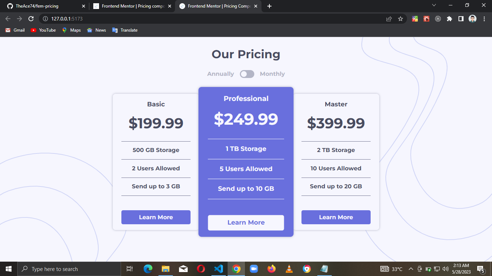

# Frontend Mentor - Pricing component with toggle solution

This is a solution to the [Pricing component with toggle challenge on Frontend Mentor](https://www.frontendmentor.io/challenges/pricing-component-with-toggle-8vPwRMIC). Frontend Mentor challenges help you improve your coding skills by building realistic projects.

## Table of contents

- [Overview](#overview)
  - [The challenge](#the-challenge)
  - [Screenshot](#screenshot)
- [My process](#my-process)
  - [Built with](#built-with)
- [Author](#author)

## Overview

### The challenge

Users should be able to:

- View the optimal layout for the component depending on their device's screen size
- Control the toggle with both their mouse/trackpad and their keyboard

### Screenshot

## My process

### Built with

- [React](https://react.dev/) - JS library
- [SASS](https://sass-lang.com/) - CSS preprocessor
- [Vite](https://vitejs.dev/) - Awesome build tool
- Desktop-first workflow

## Author

- LinkedIn - [Chisom Udonsi](https://www.linkedin.com/in/chisom-udonsi-45196b216)
- Frontend Mentor - [@TheAce74](https://www.frontendmentor.io/profile/TheAce74)
- Twitter - [@TheAce74](https://www.twitter.com/TheAce74)
